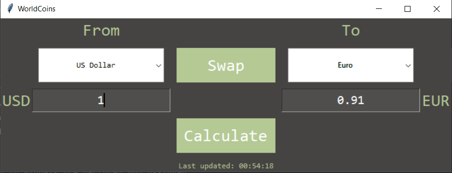

# WorldCoins
GUI application to calculate world currencies equivalences. Values of currencies are obtained from www.x-rates.com
## Techniques used
Web scraping with Beautiful Soup, Tkinter GUI libraries, Threading
## Screenshot

